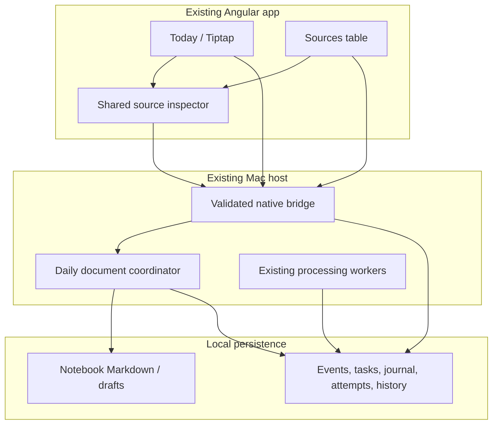

# Today and Sources — engineering design

Status: Proposed · September 27, 2026  
Requirements: [PRD](../product/PRD-TODAY-AND-SOURCES.md) · Delivery: [Build plan](../../plans/today-and-sources/BUILD-PLAN.md)

## Architecture and ownership

Keep the existing Xcode hosts, Angular application, `@maple/ui`, local MapleCore library and direct Jev development path. Angular renders one Tiptap document plus shared source NodeViews. A native document coordinator serializes durable edits to user-owned Markdown; the Mac's SQLite store retains source evidence, task truth, processing and recoverable command history.



### Verified baseline and required delta

| Existing code | Reuse | Required change |
| --- | --- | --- |
| `src/web/src/main.ts` | Hash router and dirty-note guards | Default `today`; dated route; Sources routes; compatibility aliases |
| `src/web/src/app/notebooks/markdown-editor.component.ts` and `sugar-editor/` | Direct Tiptap integration, Markdown conversion, source fallback | Stable IDs, richer codec, custom reference/request/reply nodes and Angular NodeViews |
| `src/web/src/app/notebooks/notebook.service.ts` | Serialized saves/drafts, revision checks, generation fencing | Extract reusable document session; add Today command/result coordination without weakening ordinary notebooks |
| `MapleNotebooks/NotebookLibrary.swift` | Coordinated read/write, SHA-256 revisions, create-only nil revision, durable drafts | Host-coordinated journal and date-file resolution around these primitives |
| `MapleCore/DailyNotes.swift`, `DailyNoteModels.swift` | Version/idempotency rules, clear tombstones, task links, before/after history | Migrate prose ownership to Markdown; preserve legacy history and metadata |
| `Host/DailyNoteBridge.swift` | Host/companion integration | Stop mutating file content during reads; move projections into suggested insert commands |
| `MapleCore/HistoryInbox.swift` | Bounded keyset query, snapshot watermark | Type/account/state/date/search dimensions and stable filtered query sessions |
| `Host/WebShell.swift` and `core/native-bridge.service.ts` | Existing trusted request/response boundary | Typed source list/detail/history/response and Today commands |
| `ProcessingQueue.swift`, `FactExtraction.swift`, `TaskExtraction.swift`, `StateExtraction.swift` | Leases, retries, extraction and transactional completion | Append-only transitions, provider attempts and artifact persistence |

Paths prefixed `MapleCore/` and `MapleNotebooks/` above are under `src/apple/Packages/MapleCore/Sources/`; `Host/` is under `src/apple/Just Maple/`. These are current files, not new services assumed to exist. Proposed new files/types below are labeled as such.

Current limitations matter: daily prose lives in SQLite; the notebook bridge saves then ingests best-effort; `decisions.raw_response` stores a classification response but `decisionDetail` does not expose it; task/fact extraction do not uniformly preserve raw outputs; retry counters and state response fields are overwritten. A redesigned table alone cannot deliver durable history.

## 1. Routes and feature boundaries

Keep `withHashLocation()` for the bundled WebView: product `/today` corresponds to `#/today` in the current host.

| Route | Behavior |
| --- | --- |
| `/today` | Resolve local date and configured daily notebook; open/create exactly once |
| `/today/:date` | Validated `YYYY-MM-DD`, open/create that day without implicit rollover |
| `/sources` | Filtered table with query state |
| `/sources/:eventID` | Direct-linkable detail; table backdrop on wide screens |
| `/notebooks` | Existing notebook UI, sharing codec/source NodeViews after compatibility tests |
| `/daily`, `/history`, `/activity` | Compatibility redirects/adapters preserving old day/filter intent |

Preserve onboarding, connection setup and secondary tools. Unknown paths redirect to Today. Validate actual calendar dates, not just the date regex. The host resolves a calendar/time-zone day; do not use UTC `toISOString().slice(0,10)` for user dates.

Proposed Angular features:

- `today/`: `TodayComponent`, `TodayDocumentService`, dated navigation, status and suggestion tray.
- `editor/`: extracted `MapleEditorComponent`, codec and extensions; reusable `AngularNodeView` adapter.
- `sources/`: `SourcesComponent`, `SourcesService`, typed filters/table/detail route.
- `source-reference/`: `SourceReferenceComponent`, `SourceInspectorComponent`, source reference cache shared by editor and Sources.

Feature compositions remain in `src/web/src/app`; generic controls remain in `projects/maple-common`. Avoid a second shell around mockup content. Retire the old daily textarea UI only after migration and compatibility gates.

## 2. Document format and identity (v1)

### Authorities

- **Markdown bytes:** user writing, document order, plain checklist state, request text, accepted reply text and durable references.
- **SQLite:** immutable events/revisions, canonical linked-task state, block versions/placement index, suppression tombstones, command results, run/attempt history and revision recovery. Any cached prose/Tiptap JSON is keyed by file hash and rebuildable; it is not an independent writable document.
- **Local attachment storage:** audio/transcript artifacts addressed by stable IDs. Never put base64 recordings or provider traces into the Markdown file.

A `DocumentID` is an opaque UUID in a generic managed-document registry. A daily document additionally binds `(notebookID, localDate)` through a partial unique constraint. An ordinary notebook file joins this registry on its first managed source/task/request insertion and uses the same codec, coordinator and block/backlink contracts; it has no daily date. Register by granted notebook identity and coordinated relative path, then persist the document ID in reserved metadata. Existing unextended notebooks retain their ordinary save path until registered; all subsequent writes to a managed file must use the coordinator. The managed path defaults to `Daily/YYYY-MM-DD.md`; path changes do not change identity. All managed top-level blocks and individually actionable list items have globally unique `BlockID`s. Moves preserve IDs; copy/paste remaps IDs while keeping referenced event/task IDs. Container split retains the leading ID and allocates new IDs; merge retains the first and records the absorbed IDs in history. Duplicate IDs from external files trigger reconciliation rather than silently aliasing actions.

### Readable Markdown extension

Use a versioned, minimal codec layered over the existing Markdown converters. Ordinary prose stays ordinary Markdown; one reserved HTML comment before a managed block carries identity. Typed source atoms serialize as fenced `maple-ref` JSON, which remains inspectable in generic Markdown readers. Requests/replies use ordinary readable prose with reserved metadata comments. Illustrative grammar (IDs shortened for readability):

````markdown
---
maple:
  format: 1
  document: "doc-uuid"
  day: "2026-10-30"
  timezone: "America/New_York"
---

<!-- maple:block {"v":1,"id":"heading-uuid"} -->
## Follow ups

<!-- maple:block {"v":1,"id":"paragraph-uuid"} -->
This one has the numbers we need. Check it before replying.

<!-- maple:block {"v":1,"id":"source-block-uuid"} -->
```maple-ref
{"v":1,"kind":"email","eventID":"immutable-event-uuid","label":"Dominick — Proposal"}
```

<!-- maple:block {"v":1,"id":"task-block-uuid","taskID":"task-uuid"} -->
- [ ] Review the estimate before Monday

<!-- maple:block {"v":1,"id":"request-block-uuid","kind":"maple-request","requestID":"request-uuid"} -->
@maple Can you find all my emails from Dominick?
````

Freeze the exact grammar through shared golden fixtures in milestone P1 before migration. Constrain/escape comment JSON so user input cannot terminate the comment. Place nested list-item metadata using a tested list-aware grammar; never insert comments that break CommonMark list grouping. Preserve non-Maple frontmatter verbatim and reserve only the `maple` namespace; a conflicting preexisting namespace requires explicit import, not overwrite.

Reference `eventID` already identifies an immutable revision; connector/account/external ID/revision resolve from the event. Do not trust a file's display label as original evidence. Recordings use `kind=recording` plus event/attachment IDs; source revision links remain pinned even when the entity changes. Replies include requestID, runID and evidence references, but never persisted loading flags or raw diagnostics. Block versions come from SQLite metadata and hashes, not user-editable comments as security authority.

Unsupported/malformed syntax, oversized files, unknown extension versions and ambiguous frontmatter open in exact-preserving source mode. The current `requiresSource()` deliberately rejects HTML/custom fences; replace it with codec-aware capability detection, not a blanket disabling of preservation. Maintain raw segments for untouched unsupported content. Formatted edits need semantic equivalence; untouched source-mode saves preserve exact bytes. No operation may silently drop unsupported content.

External edits reconcile by document/block IDs and hashes. Missing markers get new IDs on an explicit supported save; do not infer that similar prose is the old linked task. Invalid or duplicated identities keep an import conflict visible. Editing a linked checkbox in an external editor creates a reconciliation proposal; it does not silently change the canonical task. Ordinary checklist edits remain document-owned.

Retain the notebook library's 256,000-byte document limit initially. Report approaching/exceeded capacity and offer a new linked note; never truncate or silently split. Preserve legacy daily block limits during import validation, but do not inherit the textarea's 500-block limit without a measured editor limit.

## 3. Durable edits, concurrency and recovery

Add a UI-independent coordinator in a **proposed** `MapleDailyDocuments` package target within the existing Swift package, depending on MapleCore and MapleNotebooks; keep Xcode hosts as adapters. This avoids making the knowledge store depend directly on notebook filesystem mechanics. Reuse `NotebookLibrary` coordination and hash checks.

Proposed additive SQLite records:

| Record | Key fields / constraints |
| --- | --- |
| `managed_documents` | documentID PK, notebookID, path, currentRevision, optional day/timeZone; UNIQUE(notebookID,path), partial UNIQUE(notebookID,day) for daily documents |
| `document_block_index` | blockID PK, documentID, contentHash, version, kind, userEdited, eventID/taskID; cache/index of file membership |
| `document_mutations` | commandID PK, payloadHash, actor, base/target revisions, state, timestamps, recoverable before/after artifact references |
| `document_mutation_files` | commandID + documentID PK, expected/target hashes, file progress; supports moves |
| `document_revisions` | documentID + revision, parent revision, actor, changed IDs, recoverable content artifact |
| `document_suppressions` | source projection key + scope, clear command/block ID, restore state; preserves tombstones |
| `task_mutation_reservations` | taskID PK, commandID, expectedTaskVersion, acquiredAt; persistent ownership resolved by journal recovery, never time-only expiry |
| `document_outbox` | commandID + effect key UNIQUE, note.updated ingestion or anchored reply/task effect, delivery state |

Metadata schema is a proposal; use the repository's existing additive migration mechanism and command/history helpers instead of duplicating them. Existing `world_history` may hold mutation history when it can express these records faithfully. Store IDs, dates and hashes in constrained typed columns; validate actor from the host. A repeated command ID with the same payload returns the same result; different payload fails.

### Save protocol

There is no atomic transaction spanning SQLite and coordinated files. Promise **recoverable completion**, using this protocol:

1. Per-document serialization; for a move, acquire both document locks in sorted document-ID order. Validate expected file revisions, affected block/task versions, permissions, and bounded UTF-8 serialization.
2. Persist prepared intent and durable before/after bytes (or durably staged content-addressed artifacts) before any file replacement. Acquire task reservations in the same SQLite transaction using the expected task versions. Commit only after artifacts are recoverable. All task writers, including extraction, UI, CLI and companion actions, must check these reservations through the central mutation API; return an explicit pending/conflict result for a competing writer.
3. Use coordinated expected-hash writes. Recheck within the file coordination boundary. For create, nil expected revision means create-only; a racing winner is reopened.
4. Finalize the accepted file revision, block index/history, canonical effects and indexing outbox in one SQLite transaction. Release the command-owned task reservations in that finalization transaction; all task writers honor the reservation/CAS protocol. If a task changed meanwhile, preserve a visible pending reconciliation and do not claim completion.
5. Acknowledge `Saved` after the target file is durable and finalization is committed. Indexing may remain visibly pending independently. Drain the outbox through `KnowledgeStore.ingest` with deterministic event/effect IDs; ingest and queue persistence stay atomic inside that existing API.

Recovery checks actual file bytes: expected hash means retry is possible; target hash means finalize without rewriting; any other hash means external conflict. Do not overwrite unknown bytes. Stage/status transitions and artifacts survive restart; never return success merely because a JS debounce fired. Persist drafts before file operations and drain draft writes before leaving. A file can be saved while a canonical action remains pending; display these independently.

On startup, resolve prepared task reservations before accepting conflicting mutations. Reservations do not expire merely because time passed. A before-hash operation may safely abort and release after preserving its draft; an after-hash operation finalizes; an external conflict retains a visible reconciliation state and the reservation until explicit recovery resolves the intent. While unresolved, render the linked checkbox from canonical task state plus a pending-action indicator. Markdown checkbox text is a fallback snapshot/proposal, not authority for a linked task; persist the stable action command ID in its metadata and show a source-mode banner naming the pending task action. Never present that proposed checkmark as an acknowledged completion.

Multi-file moves have one journal with per-file progress. Keep them visibly pending until both files and metadata agree. If interrupted, complete the unmodified side when safe; if externally edited, offer recovery with preserved source/target snapshots. Do not auto-rollback over external edits. A temporary duplicate during recovery is not a second identity or a completed move.

### User/agent contention

Agent completion creates a proposed operation anchored by document ID, block ID, base block version and request/run ID. The coordinator applies it only to the current validated anchor; a changed unrelated paragraph can rebase, a changed/removed anchor becomes a conflict or retained unapplied response. User-edited reply blocks and suppressed references are protected from refresh. No polling-driven `setContent` while the user types. Patch the relevant NodeView/view state without changing document history; accepted content operations use mapped Tiptap transactions and versioned host commands.

Undo before persistence uses editor history; after persistence, an action affecting canonical state uses a compensating command with current expected versions. Command history identifies what is reversible and what needs explicit task reopening. Save-time normalization cannot implicitly submit prompts or complete tasks.

## 4. Tiptap and Angular implementation

Use the target application's existing Angular 21 / Tiptap 3 family and lockfile. Do not copy donor manifests with mixed Tiptap 2/3 extensions or legacy wrapper assumptions. Build a minimal extension set on the existing editor:

- `StableBlockIdentity`: assigns/remaps IDs with split/merge/paste fixtures.
- `SourceReference`: non-editable atom with a shared Angular source-card NodeView; annotations are adjacent editable paragraphs.
- `RecordingReference`: atom referencing local media identity, with controlled native resource resolution.
- `LinkedTaskItem`: normal task presentation plus canonical task reference and explicit command handling; local checklist remains distinct.
- `MapleRequest` and `MapleReply`: durable identities and editable content; draft/queued status hydrated from the run store. Explicit submission command only.
- Mention and slash suggestions: reuse interaction patterns but implement new typed insertion commands; do not import donor cloud/agent services.

Tiptap separates node-view UI from persisted serialization; implement both explicitly. Use Angular `createComponent`, register its view with `ApplicationRef`, update inputs without remounting, and detach/destroy subscriptions and views when the NodeView dies. Define `contentDOM` only for editable node content; handle `stopEvent`, selection, drag/drop and mutation observation so buttons/audio controls do not damage the document. See [Tiptap NodeViews](https://tiptap.dev/docs/editor/extensions/custom-extensions/node-views) and [Angular createComponent](https://angular.dev/api/core/createComponent).

Source state hydration is shared and cached by immutable event ID; batch visible IDs and refresh bounded summaries rather than fetching every payload on each keystroke. Full content/response loading is inspector-only. Sanitize rendered Markdown/HTML, allowlist link and native-media schemes, prohibit arbitrary local paths from file attributes, and keep the existing WebView origin/bridge boundary. No source/provider content is compiled as Angular templates or injected as executable HTML.

## 5. Sources query and history model

### Identity and query semantics

Keep `Event/KnowledgeStore.ingest` as the entry point. Its `(connector, account, external_id, revision)` uniqueness and payload mismatch rejection remain unchanged. User corrections use the correction API. The table displays immutable observations; entity grouping in detail uses connector/account/external identity. Ingestion failures that never created an event stay visible in connector diagnostics, not fabricated Sources rows.

Proposed `SourceQuery` contains type IDs, connector/account IDs, stage/aggregate-state filter, receivedAt interval, text query, and sort fixed initially to `(receivedAt DESC,eventID DESC)`. Human names are display-only. Extend `HistoryInbox` instead of shipping a second unbounded scanner. Reuse preview limits and page size 60 (maximum100), parameterized SQL and FTS.

A row-ID watermark alone is insufficient for a mutable processing-state filter. Create a local, bounded-lifetime query session with a materialized ordered set of matching event IDs and their compact processing summaries at the capture revision. Store it in temporary SQLite session tables, not an unbounded Angular array. Cursor contains opaque session ID, last ordering key and filter fingerprint. TTL 10 minutes, maximum four sessions per window; expired cursors return explicit `queryExpired` and refresh affordance. Cap a session at 50,000 results, expose `hasMoreMatches` and ask the user to narrow filters when capped. Counts reflect the same session and are labeled as snapshot counts. Detail shows live state with its own as-of time; refresh starts a new query. Index received time + ID and connector/account/type paths, inspect query plans and bound FTS inputs.

This initial query-session choice prioritizes correct paging under state changes; later optimization can derive temporal membership from history without changing the cursor abstraction.

### Audit records

Add append-only records atomically alongside existing queue transitions:

| Record | Essential fields |
| --- | --- |
| `processing_runs` | runID, eventID, trigger (ingest/retry/reprocess), policy version, parentRunID, requestedAt |
| `processing_transitions` | sequence PK, eventID, runID, stage, attemptID optional, from/to state, reasonCode, timestamp, context revision, related/coalesced run |
| `provider_attempts` | attemptID PK, runID, stage, parentAttemptID, provider/model, actual input artifact, prompt/schema version, start/end, transport/validation/commit outcomes, safe error code |
| `processing_artifacts` | artifactID/hash, event/run/attempt owner, media type, bounded payload or local object reference, byte count, retention/availability reason |

A proposed typed `ProviderAttemptResult<T>` carries parsed output, actual submitted context, actual successful raw response, provider/model, evidence IDs and validation result. Thread it through classification, fact checks/extraction, task extraction and state extraction. Capture repair calls as child attempts. Record scheduling and skip reasons even when no provider was called. Queue retries keep historical attempts when mutable counters reset.

Persist lease-acquisition `running` before the call. Completion records provider success separately from application success: stale leases/contexts can discard an otherwise successful result. Record expired/interrupted work on recovery; a lost response is `outcome unknown`, not an invented failure body or success. Raw successful outputs and context artifacts are local and inspector-only; safe structured failure metadata excludes authorization headers, tokens and private HTTP error bodies. Schema-invalid output is a failure, with safe validation detail; any retained output follows the same private artifact access/size rules.

Branches include classification, fact check/extraction, task extraction and state extraction; future reasoning slots use the same stage registry. Aggregate only the current effective run of each applicable branch, never all historical attempts. A retry supersedes its failed predecessor for current status while preserving the old run in History; reprocessing shows pending until the new effective run settles. Unresolved independent branches still count. Aggregate rule within those current branch runs: an applicable terminal failure dominates; otherwise active/retrying/queued work remains pending; only all applicable required stages succeeding or explicitly skipping yields complete. Display partial success as detail rather than hiding a failed branch. Store decision reasons for not-applicable, outside-window and coalesced work. Coalesced detail links the representative event/run.

Payload proposal: 1 MiB inline response/context artifact budget; larger successful artifacts remain in restricted local object storage and stream/page on demand. No payload truncation presented as a complete response. Record `available`, `pruned`, `not_recorded`, `redacted`, `missing` or `truncated` with size and reason. Default retention follows source lifetime; explicit source deletion must purge sensitive artifacts and leave only content-free audit tombstones permitted by the existing retention policy. Do not introduce automatic expiry of required successful traces in this release. Add storage-size accounting before exposing retention controls.

Legacy migration can expose already stored `decisions.raw_response` and retained state responses with a `legacy_latest_only` marker. Do not invent historic attempts, timing or request context. New history guarantees start at the migration/version boundary shown in the UI.

## 6. Native bridge and inline run contracts

Extend the existing native request channel; these are **proposed typed actions**, not new HTTP endpoints. Host resolves actor, notebook grants and trusted paths.

| Action | Input | Output / checks |
| --- | --- | --- |
| `todayOpen` | day optional, notebookID optional | documentID, day/timeZone, path, Markdown, revision, block versions, capabilities; create-only race handling |
| `documentCommit` | commandID, documentID, expectedRevision, changed block versions, Markdown / typed operations | revision and accepted command state; structured conflict preserving draft |
| `sourceList` | SourceQuery, cursor optional | bounded snapshot rows/count/filter facets, next cursor, asOf, capped flag |
| `sourceDetail` | eventID | bounded original/provenance/observed state, stage summaries and note backlinks |
| `sourceHistory` | eventID, sequence cursor | chronological transitions/attempt summaries; paged |
| `sourceArtifact` | eventID, artifactID, offset/limit | authorized bounded payload; availability and completeness flags |
| `sourceInsert` | commandID, eventID, documentID, expectedRevision, anchor | one reference identity; durable acknowledgment |
| `mapleSubmit` | commandID, documentID, requestBlockID, expectedRevision, request text | request/run ID and durable queued state; same-payload idempotency |
| `mapleRun` / `mapleCancel` | runID / commandID and runID | status/results or best-effort canceled state; late completion rules |
| `sourceRetry` | commandID, eventID, eligible stage/run, expected state version | new run/attempt linked to old, or conflict/ineligible reason |

Schema/version every DTO, cap arrays/strings and reject unknown enum values safely. Preserve request generation fencing in Angular services so stale filter/detail results cannot overwrite current selection. Avoid source text in URL params or diagnostic logs. Normal status updates use compact host revisions/events (or the existing bounded polling bridge); content hydration remains independent of editor transactions.

Submitting a dirty request first flushes its stable request ID and text through the document coordinator. The host then verifies that committed revision and atomically records the run plus its enqueue effect; `Queued` is acknowledged only after that transaction. Preserve one submit command ID across retries. A crash between file commit and run creation leaves a durable unsubmitted draft, and an explicit retry resumes submission; reopening alone never submits. A crash after run creation returns the same run on retry. Enforce a unique `(runID, reply-application)` effect and deterministic reply block ID; retry attempts cannot insert an already-applied reply again.

Inline retrieval uses a **proposed** `InlineMapleCoordinator` with durable run state. Start with a narrow read-only `find_sources` capability over the existing indexed corpus, with type/sender constraints, pagination and evidence IDs. Reuse configured model/provider transport for intent resolution and answering; expose exact coverage and context used. If no suitable provider is configured, retain the request and report configuration required. Any deterministic search tool is labeled retrieval, never substituted for a failed model response. Agents receive bounded relevant context, not the entire notebook/mailbox; retrieved instructions cannot authorize mutations. All document writes are validated anchored operations through the document coordinator, not a model-controlled filesystem path.

## 7. Design system and reference reuse

“JustMaple” names multiple local repositories. The verified modern theme source is **`/Users/riabuz/Projects/Just-Maple`** (hyphen); the current [UI provenance](../UI-PROVENANCE.md) already cites it. The older `/Users/riabuz/Projects/JustMaple` includes the SugarMaple reference.

| Reference | Selective reuse |
| --- | --- |
| `Just-Maple/ds-bundle/tokens/maple-tokens.css` | Sole light/dark palette authority; root and `.dark/[data-theme='dark']` tokens |
| `Just-Maple/apps/web/src/app/components/organisms/notebook-editor/` | Tiptap lifecycle and inline-mention, ai-bot-widget, recording-node, paste and slash-command extension patterns |
| `Just-Maple/packages/shared/src/local/{markdown-to-document,document-to-markdown}.ts` and tests | Compare minimal codec behavior; extract only needed cases |
| `JustMaple/SugarMaple/src/japanese-maple/components/document-viewer/` | Angular NodeView update/destroy and smaller recording/slash examples |
| `SugarMaple/src/library/components/editor/` | Secondary legacy editor reference; Angular19/Tiptap2 dependencies do not transfer |
| `_Maple/src/web/projects/maple-common/src/lib/ui/` | Select, command-menu, drawer-shell, tabs, code-block, audio-player, transcript-block dependency closures |

Update `scripts/generate-ui-theme.py`, `src/web/projects/maple-common/src/lib/theme/theme.css` and provenance so both modes derive from the checked-in `just-maple-tokens.css`. Retain semantic adapters needed by imported controls; map missing roles to JustMaple tokens. Light bg/surface are `#fdfbf7/#ffffff`; dark bg/surface are `#1c1917/#262524`. These values verify provenance, not permission to hard-code per-screen colors. Retain bundled Lato/Merriweather/JetBrains Mono and licenses.

Use existing app-shell/sidebar/button/input/checkbox/badge/text/empty-state exports first. Curate added exports and test dependency closure. There is no generic table in the audited donor; compose Sources with a semantic table and shared controls. The donor timeline is a photo timeline, so implement an audit sequence instead of copying it. Audit drawer focus trapping/restore and transcript elapsed-time labels. Record source paths/hashes and adaptations; leave reference repositories untouched. Exclude donor cloud, Yjs, Meilisearch, console logging of private content and unrelated server/business models.

## 8. Migration, phone and rollout

### Existing daily data

Migration is explicit, per-day and restartable. Preview existing SQLite daily blocks and destination files. Export visible blocks in order, preserving IDs, source keys, task links and user-edited flags; carry cleared tombstones into metadata/history. Validate codec round-trip and hashes before recording a completed migration marker. Retain original tables/history read-only for recovery.

If `Daily/YYYY-MM-DD.md` already exists, do not overwrite or silently concatenate. Offer a previewed import into that document through versioned insertions, or a separately named recovery note. Store `(legacyDayID, destinationDocumentID, migrationVersion)` idempotently. An empty existing file is still user-owned and subject to the same check. Quarantine unsupported/oversized content into a recoverable source-mode note and report it.

After a day migrates, disable legacy projection writes for that day. Suggested blocks use source keys/tombstones and explicit coordinator commands. Keep legacy read adapters while phone clients transition; never enable two independent writers for the same day. Rollback disables new write entry points and uses the preserved Markdown/journal; do not run an older SQLite-only writer against migrated days.

### Companion

Use existing encrypted transport and request receipts. Advertise `dailyDocumentV1` and `sourceReferenceV1`; a phone without support displays compatible read-only snapshots for migrated days and cannot use the old daily mutation path on them. New phone edits are semantic document commands with base revision, queued durably and shown pending until Mac receipt plus matching snapshot revision.

For managed daily documents, the Mac is the sole commit coordinator during this release. Do not allow the ordinary iPhone notebook direct-file editor to bypass this path; route those files to managed Today or read-only view. Cached writing may be a pending local draft, visibly distinct from saved-on-Mac content. Ordinary unmanaged notebooks keep their existing iCloud behavior. Raw provider diagnostics are not included in companion snapshots. Keep existing payload caps, whole-block/partial flags and missing-day-unavailable semantics. Ship editable phone Today only after delivery ordering/conflict tests pass; otherwise expose honest read-only compatibility.

### Rollout gates

Add separate capability flags for document codec/journal, Sources audit capture, Today UI and phone editing. Enable audit capture first; complete data migration before routing a user's primary workspace to Today. Retain old routes as adapters and a recovery view through the rollout. Preserve bundle IDs, development team, Automatic signing, existing Xcode project and required Messages access.

## 9. Verification and risks

| Risk | Required regression |
| --- | --- |
| File/SQLite disagreement | Kill after prepare, each file write and finalize; recover deterministically by hashes; injected disk/full/permission error |
| External edits and identity ambiguity | Concurrent save, missing/duplicate marker, renamed/missing file, conflicting frontmatter, imported custom Markdown |
| Task/model concurrent mutation | Reservation/CAS conflict, late/stale lease response, anchor moved/deleted, repeated command and retry |
| History lost by mutable queues | Retry reset preserves old attempts; repair call linkage; recovery marks interrupted work; legacy unavailability |
| Paging unstable under ingestion/status updates | Multi-account filters, repeated timestamps, changing stage states, capped/expired sessions and counts |
| Editor corrupts custom nodes | Unicode/IME, nested task lists, source toggle, copy/split/merge/move, undo, pasted untrusted HTML, selection retention |
| Theme/component extraction drift | Generator reproducibility; light/dark/focus/contrast screenshots; NodeView teardown and keyboard navigation |
| Companion false acknowledgment | Receipt/snapshot reordering, offline/retry, unsupported capability, large partial payload and old-client mutation rejection |

Run the existing root commands: `npm run test:core`; `swift build --package-path src/apple/Packages/MapleCore --product just-maple`; `npm test`; `npm run build:web`; `npm run test:apple`; `npm run test:providers` when changing provider adapters. Extend `NotebookTests`, `DailyNotesTests`, `HistoryInboxTests`, extraction tests and native bridge/companion suites rather than replacing coverage. Run iPhone target tests on an available simulator identified from the existing Xcode project; record scheme/destination in build evidence instead of inventing a scheme here.

Extend `scripts/daily-note-smoke.mjs` for the complete journey: temporary notebook + labeled synthetic events → Today write/save/relaunch → mixed email/iMessage/HA references → submitted Maple fixture run → Sources combined filters/history → same inspector from note → clear/restore/move → external-edit conflict. Assert bytes, event/block identities, task state, journal completion and attempt rows, not screenshots alone. Then perform a separately labeled, consented live Jev/downstream quality check; failure is recorded as failure and never masked by fixtures.
